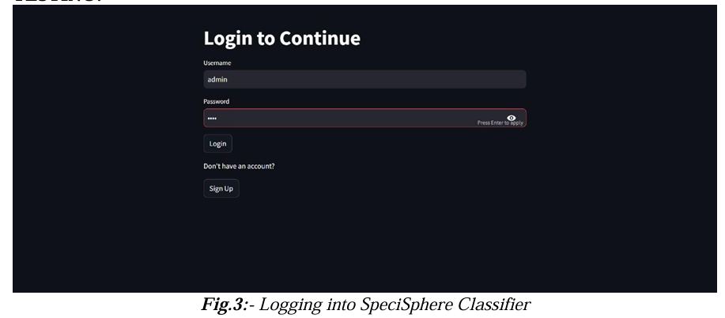
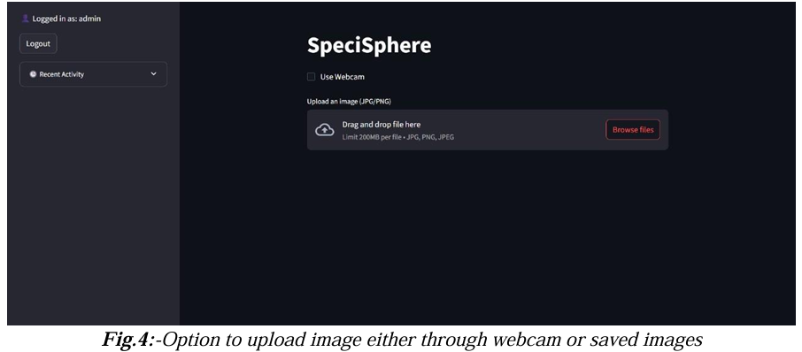
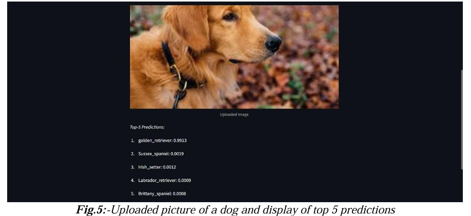
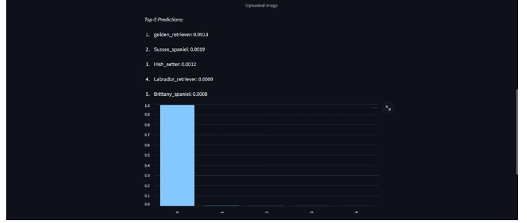
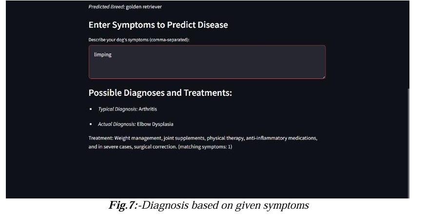

# 🐶 SpeciSphere Classifier

An AI-powered web application that classifies images and provides veterinary diagnostics for dogs using deep learning.

📄 Published Research Paper:
https://doi.org/10.5281/zenodo.15542627

---

## 🚀 Key Features

- 📷 Image upload & real-time webcam capture
- 🧠 Dog breed classification using ResNet-50
- 📊 Top-5 predictions with confidence scores
- 🐾 Breed-specific disease prediction
- 💊 Treatment suggestions
- 🔐 User authentication (login/signup)
- 🕒 Activity tracking using SQLite
- 🎤 Voice-based symptom input (advanced feature)

---

## 🏗️ System Architecture

Image → Preprocessing → ResNet-50 → Breed Detection →  
Symptoms Input → Disease Prediction → Treatment Output

---

## 🛠️ Tech Stack

- Python
- Streamlit
- PyTorch / TorchVision
- OpenCV
- SQLite
- NumPy

---

## 📸 Screenshots
## 📸 Screenshots

### 🔐 Login Page


### 📤 Upload / Webcam


### 🧠 Predictions


### 📊 Confidence Graph


### 💊 Disease Prediction


---

## ⚙️ Installation

```bash
git clone https://github.com/hrushijjyan/SpeciSphere-Classifier.git
cd SpeciSphere-Classifier
pip install -r requirements.txt
streamlit run main.py
